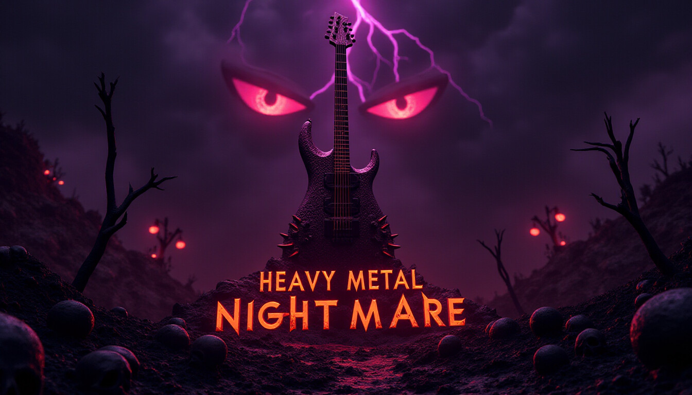
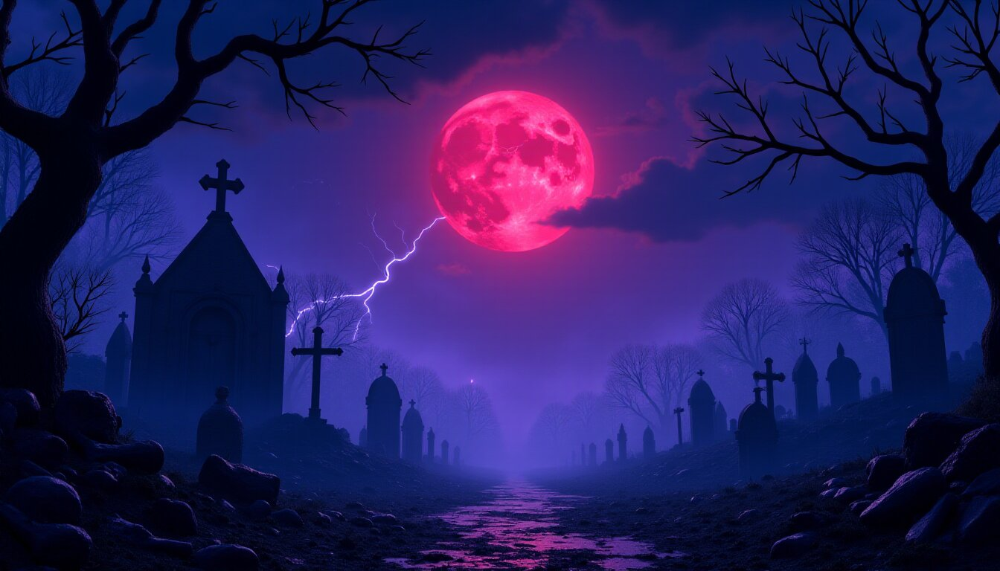
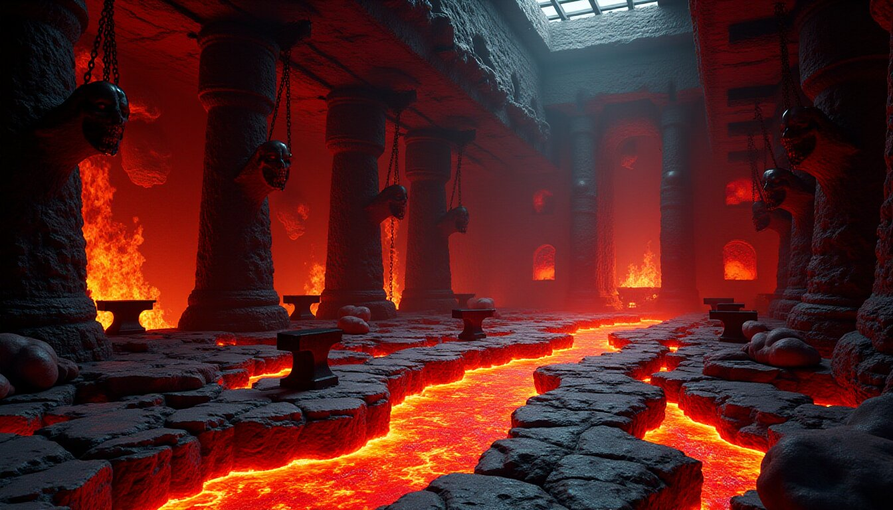
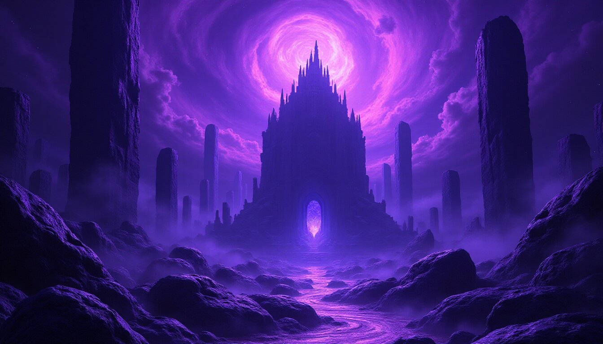

<!-- HEAVY METAL NIGHTMARE README -->

<div align="center">

```
██╗  ██╗███████╗ █████╗ ██╗   ██╗██╗   ██╗    ███╗   ███╗███████╗████████╗ █████╗ ██╗     
██║  ██║██╔════╝██╔══██╗╚██╗ ██╔╝╚██╗ ██╔╝    ████╗ ████║██╔════╝╚══██╔══╝██╔══██╗██║     
███████║█████╗  ███████║ ╚████╔╝  ╚████╔╝     ██╔████╔██║█████╗     ██║   ███████║██║     
██╔══██║██╔══╝  ██╔══██║  ╚██╔╝    ╚██╔╝      ██║╚██╔╝██║██╔══╝     ██║   ██╔══██║██║     
██║  ██║███████╗██║  ██║   ██║      ██║       ██║ ╚═╝ ██║███████╗   ██║   ██║  ██║███████╗
╚═╝  ╚═╝╚══════╝╚═╝  ╚═╝   ╚═╝      ╚═╝       ╚═╝     ╚═╝╚══════╝   ╚═╝   ╚═╝  ╚═╝╚══════╝
                                                                                           
███╗   ██╗██╗ ██████╗ ██╗  ██╗████████╗███╗   ███╗ █████╗ ██████╗ ███████╗
████╗  ██║██║██╔════╝ ██║  ██║╚══██╔══╝████╗ ████║██╔══██╗██╔══██╗██╔════╝
██╔██╗ ██║██║██║  ███╗███████║   ██║   ██╔████╔██║███████║██████╔╝█████╗  
██║╚██╗██║██║██║   ██║██╔══██║   ██║   ██║╚██╔╝██║██╔══██║██╔══██╗██╔══╝  
██║ ╚████║██║╚██████╔╝██║  ██║   ██║   ██║ ╚═╝ ██║██║  ██║██║  ██║███████╗
╚═╝  ╚═══╝╚═╝ ╚═════╝ ╚═╝  ╚═╝   ╚═╝   ╚═╝     ╚═╝╚═╝  ╚═╝╚═╝  ╚═╝╚══════╝
```

# ⚡ HEAVY METAL NIGHTMARE ⚡

### *Face the demons. Shred the darkness.*



[](https://github.com)
[](https://github.com)
[](https://github.com)

## 🎮 [PLAY NOW - GitHub Pages](https://lefoulkrod.github.io/heavy_metal_nightmare/)

**[⬆️ CLICK HERE TO PLAY THE GAME ⬆️](https://lefoulkrod.github.io/heavy_metal_nightmare/)**

</div>

---

## 🤘 GAME DESCRIPTION

**Heavy Metal Nightmare** is a brutal, browser-based action game forged in the fires of hell itself. You are the last **Guitar Warrior**, wielding your enchanted axe against hordes of demonic entities that have escaped from the abyss.

Battle through **three nightmarish realms**:
- 🪦 **The Cemetery of Shadows** - Where the dead refuse silence
- 🔥 **Hell's Forge** - Where demons are born in fire
- 👁️ **The Abyssal Throne** - Where the Shadow Lord awaits

With **procedurally generated heavy metal music** powering your every strike, every slash of your blade creates a symphony of destruction. Can you survive the nightmare and claim your place among the Metal Gods?

---

## 🔥 FEATURES

| Feature | Description |
|---------|-------------|
| ⚔️ **Intense Combat** | Fast-paced hack-and-slash action with screen-shaking impacts |
| 🎸 **Procedural Metal Music** | Dynamic heavy metal soundtrack generated in real-time using Web Audio API |
| 👹 **Demonic Enemies** | 4 unique enemy types: Skeletons, Imps, Hell Knights, and the Shadow Lord |
| 🎨 **Hand-Crafted Art** | Custom pixel-art sprites and atmospheric backgrounds |
| 💀 **3 Epic Levels** | Each with unique themes, enemies, and atmospheric effects |
| ⚡ **Power-Ups** | Health orbs and power shards to enhance your destructive capabilities |
| 🏆 **Score System** | Rack up points and prove your worth to the Metal Gods |
| 🎚️ **Dynamic Difficulty** | Increasing challenge as you progress through the realms |

---

## 🎮 HOW TO PLAY

### Option 1: Play Online (Recommended)
**🌐 [Play directly in your browser](https://lefoulkrod.github.io/heavy_metal_nightmare/)**

No download required! Just click and play.

### Option 2: Play Locally
1. **Open `index.html`** in your favorite browser
2. **Click "ENTER THE ABYSS"** to begin your nightmare
3. **Survive waves of demons** in each of the 3 levels
4. **Collect power-ups** dropped by defeated enemies
5. **Defeat the Shadow Lord** in the Abyssal Throne to claim victory!

> 💀 **Pro Tip:** Time your attacks carefully and don't let enemies surround you. The Guitar Warrior fights best when not overwhelmed!

---

## 🎛️ CONTROLS

```
┌─────────────────────────────────────────────────────────┐
│  MOVEMENT          │  ATTACK           │  SYSTEM        │
├────────────────────┼───────────────────┼────────────────┤
│  W / ↑  - Move Up  │  SPACE - Attack   │  P - Pause     │
│  S / ↓  - Move Down│                   │                │
│  A / ←  - Move Left│                   │                │
│  D / →  - Move Right                  │                │
└─────────────────────────────────────────────────────────┘
```

---

## 📸 SCREENSHOTS

### Level 1: Cemetery of Shadows


### Level 2: Hell's Forge


### Level 3: The Abyssal Throne


---

## 🛠️ TECH STACK

```
┌────────────────────────────────────────┐
│  HTML5 Canvas  │  Rendering engine     │
│  CSS3          │  Styling & effects    │
│  JavaScript    │  Game logic & physics │
│  Web Audio API │  Procedural metal     │
└────────────────────────────────────────┘
```

---

## 👹 ENEMY TYPES

| Enemy | Health | Speed | Damage | Description |
|-------|--------|-------|--------|-------------|
| 💀 Skeleton | 30 | Slow | 10 | Weak but numerous |
| 👿 Imp | 20 | Fast | 15 | Flying pest |
| ⚔️ Hell Knight | 100 | Medium | 25 | Armored tank |
| 👑 Shadow Lord | 500 | Slow | 40 | **BOSS** |

---

## 🏆 HIGH SCORES

```
┌─────────────────────────────────────┐
│  RANK  │  SCORE   │  PLAYER        │
├─────────────────────────────────────┤
│   #1   │  10,000  │  METAL GOD     │
│   #2   │   7,500  │  SHRED MASTER  │
│   #3   │   5,000  │  DEMON SLAYER  │
│   #4   │   2,500  │  GUITAR HERO   │
│   #5   │   1,000  │  NOVICE        │
└─────────────────────────────────────┘
```

---

## 📁 FILE STRUCTURE

```
heavy_metal_nightmare/
├── index.html                 # Main game file (play this!)
├── README.md                  # This file
├── title_screen.jpg           # Title screen artwork
├── bg_level1_cemetery.jpg     # Level 1 background
├── bg_level2_forge.jpg        # Level 2 background
├── bg_level3_abyss.jpg        # Level 3 background
├──
├── 🎸 PLAYER SPRITES
├── player_idle.png
├── player_attack.png
├── player_walk1.png
├── player_walk2.png
│
├── 💀 ENEMY SPRITES (16 files)
├── enemy_skeleton_*.png       # 4 sprites
├── enemy_imp_*.png            # 4 sprites
├── enemy_hellknight_*.png     # 4 sprites
└── enemy_shadowlord_*.png     # 4 sprites
```

---

## 🚀 QUICK START

### Play Online (Easiest)
**👉 [https://lefoulkrod.github.io/heavy_metal_nightmare/](https://lefoulkrod.github.io/heavy_metal_nightmare/)**

### Play Locally
```bash
# Clone the repository
git clone https://github.com/lefoulkrod/heavy_metal_nightmare.git

# Enter the directory
cd heavy_metal_nightmare

# Open in browser (Linux/Mac)
open index.html

# Or on Windows, simply double-click index.html
```

---

## 🎸 CREDITS

<div align="center">

### **FORGED BY**

```
 ██████╗ ██████╗ ███╗   ███╗██████╗ ██╗   ██╗████████╗██████╗  ██████╗ ███╗   ██╗
██╔════╝██╔═══██╗████╗ ████║██╔══██╗██║   ██║╚══██╔══╝╚════██╗██╔═══██╗████╗  ██║
██║     ██║   ██║██╔████╔██║██████╔╝██║   ██║   ██║    █████╔╝██║   ██║██╔██╗ ██║
██║     ██║   ██║██║╚██╔╝██║██╔═══╝ ██║   ██║   ██║   ██╔═══╝ ██║   ██║██║╚██╗██║
╚██████╗╚██████╔╝██║ ╚═╝ ██║██║     ╚██████╔╝   ██║   ███████╗╚██████╔╝██║ ╚████║
 ╚═════╝ ╚═════╝ ╚═╝     ╚═╝╚═╝      ╚═════╝    ╚═╝   ╚══════╝ ╚═════╝ ╚═╝  ╚═══╝
```

**COMPUTRON_9000**

*In the darkest code, the heaviest metal is forged.*

[](https://github.com/lefoulkrod)

</div>

---

<div align="center">

## 🎮 [PLAY NOW](https://lefoulkrod.github.io/heavy_metal_nightmare/)

**[https://lefoulkrod.github.io/heavy_metal_nightmare/](https://lefoulkrod.github.io/heavy_metal_nightmare/)**

**🤘 PLAY LOUD. PLAY PROUD. PLAY METAL. 🤘**

*© 2025 Heavy Metal Nightmare. All riffs reserved.*

</div>
